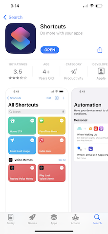
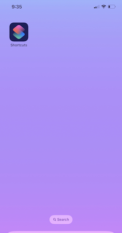
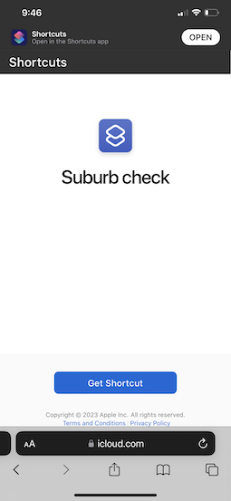
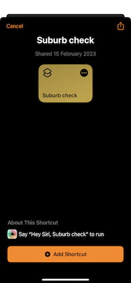
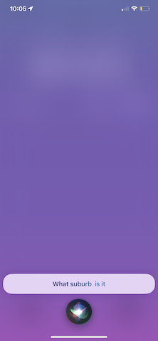
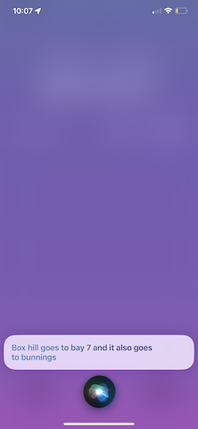

# SHORTCUT SUBURB TELLER
> This shortcut will help the user to know where what pallet goes where without having to look at the paper by just using siri

## Installation
Link: – [Download shortcuts app on app store](https://apps.apple.com/au/app/shortcuts/id1462947752)

Once you download Shortcut will appear on your screen

Before you open it, you need to follow these steps to allow shortcuts to download and use other users shortcuts, its only three steps

Link: – [Allow untrusted shortcuts guide](https://osxdaily.com/2021/01/28/how-install-third-party-shortcuts-iphone-ipad/#:~:text=Head%20over%20to%20%E2%80%9CSettings%E2%80%9D%20from,toggle%20to%20enable%20these%20shortcuts.)

Once you finish these steps you can go ahead and download the shortcut from [here]()

This will take you to this screen

You can click on 'Get Shortcut' to download it from the cloud, It will prompt to open it in shortcuts then click open.

This will look something like this

After you click Add shortcut,you can now exit the shortcuts and can start using siri commands

## Usage example

To use siri you need to follow these steps

'Hey siri, suburb check' then you will see this screen and siri asking 'What suburb is it?'

In this case i asked for 'box hill' and it responded back to me with this

That's it you are done.
## Development setup

## Release History

* 0.0.1
    * Work in progress

## Meta

[Twitter](https://twitter.com/)

## Contributing

1. Fork it (<https://github.com/prgrmr-yn/shortcut-for-work/fork>)
2. Create your feature branch (`git checkout -b feature/fooBar`)
3. Commit your changes (`git commit -am 'Add some fooBar'`)
4. Push to the branch (`git push origin feature/fooBar`)
5. Create a new Pull Request
